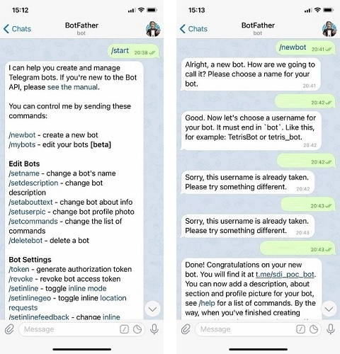

### Conversation API Telegram Bot Support

> 📘 Note
>
> Telegram Bot channel is currently open to selected customers on [Sinch Portal](https://dashboard.sinch.com/convapi/overview),
>  - to request access, send email to [telegram@sinch.com](mailto:telegram@sinch.com)
>  - for beta support, send to [ConvAPI_Telegram_beta@sinch.com](mailto:ConvAPI_Telegram_beta@sinch.com)

Telegram Bot channel enables communication with users of Telegram ecosystem through Conversation API.
You need a Telegram bot for integrating your Conversation API with Telegram. If you do not already
have one follow the steps below to create a new Telegram bot:

1. You must have an active Telegram account which will be used to administer your new bot.
   You already have an account if you have Telegram app installed and can sign in. Otherwise, download the Telegram app
   from the app store of your mobile device.

2. Find BotFather in Telegram app, type `/start` to get the list of all commands. type `/newbot` to start creating your 
   bot by following the instructions. Once your bot is created, its token will appear. Please keep this token.



#### Channel Configuration

The easiest way to configure your Conversation API **app** with Telegram support is to use
[Sinch Portal](https://dashboard.sinch.com/convapi/overview). Just select your **app** and
click on "SET UP CHANNEL" beside the Telegram Bot channel. You will be asked to enter the token for your Telegram bot.

##### Setup Telegram Bot integration using the API

If you decide to configure your **app** through API calls follow these 2 steps:

1. Update your Conversation API **app** with Telegram Bot channel credentials as
   given in the example snippet below:

```json
{
  "channel_credentials": [
    {
      "channel": "TELEGRAM",
      "telegram_credentials": {
        "token": "{{TELEGRAM_BOT_TOKEN}}"
      }
    }
  ]
}
```

You need to replace `{{TELEGRAM_BOT_TOKEN}}` with your Telegram bot's access token.

2. Set the webhook for your Telegram bot to the URL of the Conversation API adapter
   using the instructions in the [Telegram Bot API documentation](https://core.telegram.org/bots/api#setwebhook).
   This step is done automatically when configuring the Telegram integration through
   the [Sinch Portal](https://dashboard.sinch.com/convapi/overview).
   The format of the adapter callback URL is:
   `https://telegram-adapter.{{REGION}}.conversation-api.prod.sinch.com/adapter/v1/{{CONVERSATION_APP_ID}}/callback`

Where {{REGION}} is one of `eu1` or `us1` and must match the region of your **app** while
{{CONVERSATION_APP_ID}} is the id of your Conversation API **app**.

Do not forget to add Conversation API webhooks to your **app** in order to receive delivery
receipts and inbound messages. Adding webhooks can be done through the portal or
using the management API.

##### Testing the integration

To test your integration, open the Telegram app and search for the name of your Telegram bot, click `Start Bot` 
or `Restart Bot` to subscribe to bot. You will get 2 callbacks on your Conversation API webhooks like:

(IDs and Identities are masked)

```json
{
  "app_id": "01EPRZJ1HXTDE9BNM6JT4417GE",
  "accepted_time": "2021-06-08T07:54:35.997638Z",
  "event_time": "2021-06-08T07:54:35.171Z",
  "project_id": "ab5336b1-d1b0-45e8-aaa6-b35f13c41d1b",
  "opt_in_notification": {
    "contact_id": "01EPSAJOPKWLQ80W5PM5P10HMY",
    "channel": "TELEGRAM",
    "identity": "1234567",
    "status": "OPT_IN_SUCCEEDED",
    "request_id": "01F7N9VEK2MZEX0Q9D613H1DH5"
  }
}
```

```json
{
  "app_id": "01EPRZJ1HXTDE9BNM6JT4417GE",
  "accepted_time": "2021-06-08T07:54:35.997638Z",
  "event_time": "2021-06-08T07:54:35.171Z",
  "project_id": "ab5336b1-d1b0-45e8-aaa6-b35f13c41d1b",
  "message": {
    "id": "01F7NEMGK72JA707P229260VJ2",
    "direction": "TO_APP",
    "contact_message": {
      "text_message": {
        "text": "/start"
      }
    },
    "channel_identity": {
      "channel": "TELEGRAM",
      "identity": "1234567",
      "app_id": "01EPRZJ1HXTDE9BNM6JT4417GE"
    },
    "conversation_id": "01F6PEMQ3X4FAS1475DPQY10VT",
    "contact_id": "01EPSAJOPKWLQ80W5PM5P10HMY",
    "metadata": "",
    "accept_time": "2021-06-08T07:54:35.171Z"
  }
}
```

One is `optin_in_notification` and the other is the actual message sent from the handset.

Both callbacks contain a field `contact_id` which is the identifier of the contact which was automatically created when 
processing the inbound Telegram message. This contact contains the channel identity for the Telegram user, and you can 
use this `contact_id` to reach the Telegram user.

The Telegram Bot channel identities are identifiers which are scoped to all apps. This means that the same Telegram
user will have the same channel identities for two different Conversation API **apps**.

#### Rich Message Support

This section provides detailed information about which rich messages are
natively supported by Telegram Bot channel and what transcoding is applied in
other cases.

##### Sending Messages

Here we give a mapping between Conversation API generic message format and the Telegram rendering on mobile devices.
Please note that for the sake of brevity the JSON snippets do not include the **recipient** and **app_id** which are 
both required when sending a message.

When sending messages on Telegram Bot you can use Telegram channel specific properties, like Telegram Link Disable. 
Check out [**Channel Specific Properties**](doc:conversation-channel-properties) for more info.

###### Text Messages

---

Conversation API POST `messages:send`

```json
{
  "message": {
    "text_message": {
      "text": "Text message from Sinch Conversation API."
    }
  }
}
```

The rendered message:


###### Multilingual Text Messages

---

Conversation API POST `messages:send`

```json
{
  "message": {
    "text_message": {
      "text": "Sinch总部位于瑞典斯德哥尔摩。\n\nSinch, पूर्व में CLX कम्युनिकेशंस, एक दूरसंचार और क्लाउड संचार प्लेटफ़ॉर्म है जो"
    }
  }
}
```

The rendered message:


###### Picture Messages

---

Conversation API POST `messages:send`

```json
{
  "message": {
    "media_message": {
      "url": "https://1vxc0v12qhrm1e72gq1mmxkf-wpengine.netdna-ssl.com/wp-content/uploads/2018/12/favicon.png"
    }
  }
}
```

The rendered message:


###### Video Messages

---

Conversation API POST `messages:send`

```json
{
  "message": {
    "media_message": {
      "url": "https://url.to/your/video.mp4"
    }
  }
}
```

The rendered message:


###### Choice Messages

---

Conversation API POST `messages:send`

```json
{
   "message": {
      "choice_message": {
         "text_message": {
            "text": "What do you want to do?"
         },
         "choices": [
            {
               "text_message": {
                  "text": "Suggested Reply Text"
               }
            },
            {
               "text_message": {
                  "text": "Just Another Suggestion"
               }
            },
            {
               "text_message": {
                  "text": "Option 3"
               }
            }
         ]
      }
   },
}
```
Choice / Card / Carousel messages are transcoded to Text message.

The rendered message:


###### Location Messages

---

Conversation API POST `messages:send`

```json
{
  "message": {
    "location_message": {
      "title": "Location Message",
      "label": "Enriching Engagement",
      "coordinates": {
        "latitude": 55.610479,
        "longitude": 13.002873
      }
    }
  }
}
```

The rendered message:


##### Receiving Messages

Telegram channel supports various kinds of MO messages - text, media, location. All of these are delivered by 
Conversation API with POST to `MESSAGE_INBOUND` webhook:

---

Example text MO:

```json
{
   "app_id": "01EPRZJ1HXTDE9BNM6JT4417GE",
   "accepted_time": "2021-06-08T07:54:35.997638Z",
   "event_time": "2021-06-08T07:54:35.171Z",
   "project_id": "ab5336b1-d1b0-45e8-aaa6-b35f13c41d1b",
   "message": {
      "id": "01F7NEMGK72JA707P229260VJ2",
      "direction": "TO_APP",
      "contact_message": {
         "text_message": {
            "text": "/start"
         }
      },
      "channel_identity": {
         "channel": "TELEGRAM",
         "identity": "1234567",
         "app_id": "01EPRZJ1HXTDE9BNM6JT4417GE"
      },
      "conversation_id": "01F6PEMQ3X4FAS1475DPQY10VT",
      "contact_id": "01EPSAJOPKWLQ80W5PM5P10HMY",
      "metadata": "",
      "accept_time": "2021-06-08T07:54:35.171Z"
   }
}
```

---

Example location MO:

```json
{
   "app_id": "01EPRZJ1HXTDE9BNM6JT4417GE",
   "accepted_time": "2021-06-08T09:46:09.797607Z",
   "event_time": "2021-06-08T09:46:09.797607Z",
   "project_id": "ab5336b1-d1b0-45e8-aaa6-b35f13c41d1b",
   "message": {
      "id": "01EKJ0Z07XKM6H04VB5Q941QBP",
      "direction": "TO_APP",
      "contact_message": {
         "location_message": {
            "title": "",
            "coordinates": {
               "latitude": 55.73064,
               "longitude": 13.160131
            },
            "label": ""
         }
      },
      "channel_identity": {
         "channel": "TELEGRAM",
         "identity": "1344913942",
         "app_id": "01EPRZJ1HXTDE9BNM6JT4417GE"
      },
      "conversation_id": "01EKJ0KSWXMVDF05MG9TQ20S06",
      "contact_id": "01F6PMEFRNHR201C7ZKBX007PE",
      "metadata": "",
      "accept_time": "2021-06-08T09:46:09.797607Z"
   }
}
```

---

Example media message:

```json
{
   "app_id": "01EPRZJ1HXTDE9BNM6JT4417GE",
   "accepted_time": "2021-06-08T09:45:39.284927Z",
   "event_time": "2021-06-08T09:45:39.284927Z",
   "project_id": "ab5336b1-d1b0-45e8-aaa6-b35f13c41d1b",
   "message": {
      "id": "01F7NG6SF8BV9J0WHT0FNE0GFR",
      "direction": "TO_APP",
      "contact_message": {
         "media_message": {
            "url": "https://convapi-eu1tst.s3.eu-west-1.amazonaws.com/01EPRZJ1HXTDE9BNM6JT4417GE/01F7NG6S58PYX61S8FXPXW0GW0.mp4",
            "thumbnail_url": ""
         }
      },
      "channel_identity": {
         "channel": "TELEGRAM",
         "identity": "1234567",
         "app_id": "01EPRZJ1HXTDE9BNM6JT4417GE"
      },
      "conversation_id": "01F6PMEFTK88Z013PECHAW18G0",
      "contact_id": "01F6PMEFRNHR201C7ZKBX007PE",
      "metadata": "",
      "accept_time": "2021-06-08T09:45:39.284927Z"
   }
}
```

---

##### Receiving Status

Telegram Bot does not provide delivery status, the positive status of a message delivery to Telegram channel will be 
`QUEUED_ON_CHANNEL`. 

```json
{
   "app_id": "01EPRZJ1HXTDE9BNM6JT4417GE",
   "accepted_time": "2021-06-08T10:14:25.450Z",
   "event_time": "2021-06-08T10:14:25.866745Z",
   "project_id": "ab5336b1-d1b0-45e8-aaa6-b35f13c41d1b",
   "message_delivery_report": {
      "message_id": "01F7NHVFDA09MQ0QZZ3DMD1TCD",
      "conversation_id": "01F6PEMQ3X4FAS1475DPQY10VT",
      "status": "QUEUED_ON_CHANNEL",
      "channel_identity": {
         "channel": "TELEGRAM",
         "identity": "1234567",
         "app_id": "01EPRZJ1HXTDE9BNM6JT4417GE"
      },
      "contact_id": "01EPSAJOPKWLQ80W5PM5P10HMY",
      "metadata": ""
   }
}
```

---

If the status is `FAILED` the reason will include more information about the failure.
 
```json
{
  "app_id": "01EPRZJ1HXTDE9BNM6JT4417GE",
  "accepted_time": "2021-06-08T10:05:06.244Z",
  "event_time": "2021-06-08T10:05:06.551038Z",
  "project_id": "ab5336b1-d1b0-45e8-aaa6-b35f13c41d1b",
  "message_delivery_report": {
    "message_id": "01F7NHADA4ACWR150GRK14102N",
    "conversation_id": "01F6PEMQ3X4FAS1475DPQY10VT",
    "status": "FAILED",
    "channel_identity": {
      "channel": "TELEGRAM",
      "identity": "1234567",
      "app_id": "01EPRZJ1HXTDE9BNM6JT4417GE"
    },
    "contact_id": "01EPSAJOPKWLQ80W5PM5P10HMY",
    "reason": {
      "code": "MEDIA_NOT_REACHABLE",
      "description": "The provided media [https://someone.github.io/sample.png] responded with [Bad Gateway]",
      "sub_code": "UNSPECIFIED_SUB_CODE"
    },
    "metadata": ""
  }
}
```

---

##### Unsubscribe Bot

It is possible for users to block a Telegram Bot by using "Stop Bot" (or "Delete Chat" depending on iOS or Android) from
their Telegram App. When this happens, an opt-out notification will be sent to App webhook callback so customers can take 
action such as removing contact_id from their user list.

```json
{
  "app_id": "01EPRZJ1HXTDE9BNM6JT4417GE",
  "accepted_time": "2021-06-08T07:54:03.165316Z",
  "event_time": "2021-06-08T07:54:02.112Z",
  "project_id": "ab5336b1-d1b0-45e8-aaa6-b35f13c41d1b",
  "opt_out_notification": {
    "contact_id": "01EPSAJOPKWLQ80W5PM5P10HMY",
    "channel": "TELEGRAM",
    "identity": "1234567",
    "status": "OPT_OUT_SUCCEEDED",
    "request_id": "01F7N9TEH11X7B15XQ6VBR04G7"
  }
}
```
